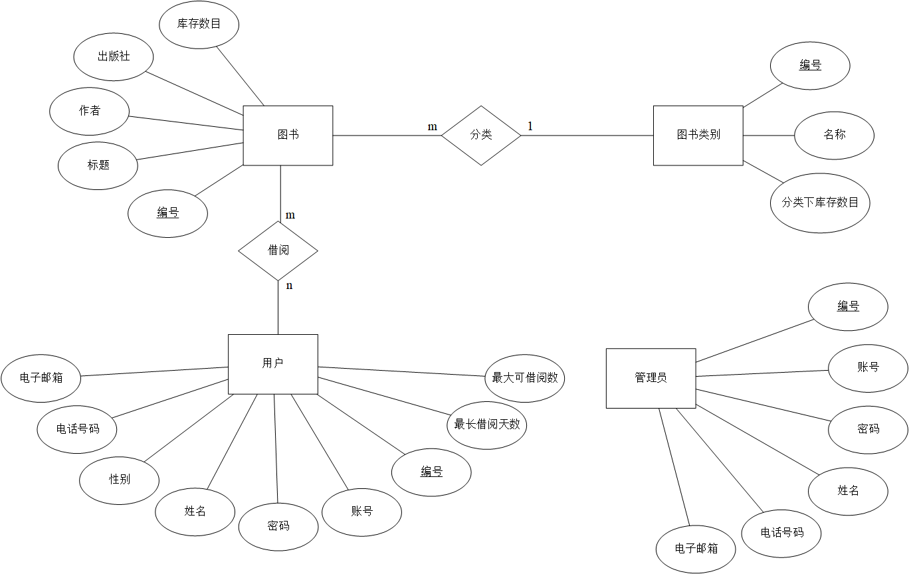

# 使用 SpringBoot + MyBatis 搭建 Web 应用的样例
## 仓库浏览指引
 - `guide`: 开发向导和入门指南。
 - `demo_preview`: 用以预习的工程文件，配合`guide`中的教学食用。
 - `demo_display`: 一个像模像样的 SpringBoot 应用（也许）。
 - `Q&A.md`: 问题与解答，假如你在开发过程中遇到了问题，在其中使用`ctrl` + `F` 搜索问题的关键词以及解决方案。
 - `database`: `demo_display`中所使用的数据库的相关配置。
 - `知识雪豹.md`: 本仓库的项目在开发中遇到的技术难点汇总。

## 协同开发指引
 - 本仓库同时用以本小组多人协同开发，小组使用`git`进行版本控制。
 - 接口测试和文档编辑使用 Apifox ，接口文档见：[Apifox](https://apifox.com/apidoc/shared-feba2b4b-6cab-40fc-9309-ce4bc9dd8dc6)
  
## `demo_display`说明
### 数据库
该数据库模型是一个图书管理系统，包含五张表：`tb_admin` 表存储管理员信息，`tb_book_category` 表存储书籍分类信息，`tb_book` 表存储书籍信息，`tb_borrow` 表记录借书信息，`tb_user` 表存储用户信息。各表之间通过外键建立关联，例如书籍与分类、借书记录与用户及书籍。此模型支持管理员管理图书和用户借书过程的操作。

#### 1. `tb_admin` 表

| 字段名       | 数据类型 | 约束条件                | 描述           |
| ------------ | -------- | ----------------------- | -------------- |
| `id`         | `bigint`   | `PRIMARY KEY AUTO_INCREMENT` | 管理员唯一标识 |
| `username`   | `varchar(50)` |` UNIQUE NOT NULL`        | 用户名         |
| `password`   | `varchar(50)` | `NOT NULL`               | 密码           |
| `name`       | `varchar(50)` |` NOT NULL`               | 姓名           |
| `phone`      | `varchar(50)` | `NOT NULL`               | 电话           |
| `email`      | `varchar(50)` | `NOT NULL`               | 邮箱           |
| `created_at` | `datetime` | `DEFAULT (now())`         | 创建时间       |

#### 2. `tb_book_category` 表

| 字段名       | 数据类型 | 约束条件                | 描述           |
| ------------ | -------- | ----------------------- | -------------- |
| `id`         | `bigint`   | `PRIMARY KEY AUTO_INCREMENT` | 分类唯一标识   |
| `name`       | `varchar(50)` | `UNIQUE`                | 分类名称       |
| `quantity`   | `int`      |                         | 分类下书籍数量 |
| `created_at` | `datetime` | `DEFAULT (now())`         | 创建时间       |

#### 3. `tb_book` 表

| 字段名       | 数据类型 | 约束条件                | 描述           |
| ------------ | -------- | ----------------------- | -------------- |
| `id`         | `bigint`   | `PRIMARY KEY` `AUTO_INCREMENT` | 图书唯一标识   |
| `title`      | `varchar(50)` |                         | 书名           |
| `author`     | `varchar(50)` |                         | 作者           |
| `category_id`| `bigint`   | `FOREIGN KEY REFERENCES tb_book_category(id)` | 分类ID  |
| `publisher`  | `varchar(50)` |                         | 出版社         |
| `quantity`   | `int`      |                         | 库存数量       |
| `created_at` | `datetime` | `DEFAULT (now())`         | 创建时间       |

#### 4. `tb_borrow` 表

| 字段名            | 数据类型 | 约束条件                | 描述           |
| ----------------- | -------- | ----------------------- | -------------- |
| `id`              | `bigint`   | `PRIMARY KEY` `AUTO_INCREMENT` | 借书记录唯一标识 |
| `user_id`         | `bigint`   | `FOREIGN KEY REFERENCES` `tb_user`(`id`) | 用户ID  |
| `book_id`         | `bigint`   | `FOREIGN KEY REFERENCES` `tb_book`(`id`) | 图书ID  |
| `borrow_date`     | `datetime` | `DEFAULT (now())`         | 借书日期       |
| `return_date`     | `datetime` |                         | 计划还书日期   |
| `really_return_date` | `datetime` |                         | 实际还书日期   |

#### 5. `tb_user` 表

| 字段名            | 数据类型 | 约束条件                | 描述           |
| ----------------- | -------- | ----------------------- | -------------- |
| `id`              | `bigint`   | `PRIMARY KEY` `AUTO_INCREMENT` | 用户唯一标识   |
| `username`        | `varchar(50)` | `UNIQUE NOT NULL`        | 用户名         |
| `password`        | `varchar(50)` | `NOT NULL`               | 密码           |
| `name`            | `varchar(50)` | `NOT NULL`              | 姓名           |
| `gender`          | `varchar(50)` | `DEFAULT '男'`           | 性别           |
| `phone`           | `varchar(50)` | `NOT NULL`               | 电话           |
| `email`           | `varchar(50)` | `NOT NULL`               | 邮箱           |
| `max_borrow_days` | `int`      | `DEFAULT 30`              | 最大借书天数   |
| `max_borrow_books`| `int`      | `DEFAULT 5`               | 最大借书数量   |
| `created_at`      | `datetime` | `DEFAULT (now())`         | 创建时间       |

#### 表间关系
- `tb_book` 表的 `category_id` 字段是外键，关联到 `tb_book_category` 表的 `id` 字段。
- `tb_borrow` 表的 `user_id` 字段是外键，关联到 `tb_user` 表的 `id` 字段。
- `tb_borrow` 表的 `book_id` 字段是外键，关联到 `tb_book` 表的 `id` 字段。
