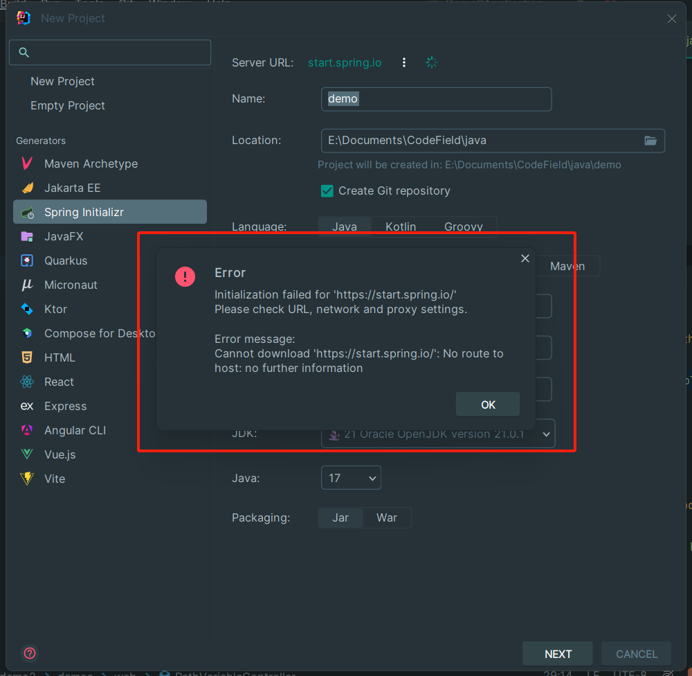

## Q&A

所有零零散散，不适合在`guide`中说明的问题，都会放到这里~

### No.01 在2.1生成工程 下载依赖时报错

#### 问题描述
```
Error: Cannot download 'https://start.spring.io/starter.zip?type=maven-project&bootVersion=3.2.5&groupId=com.example&artifactId=MyDemo&name=MyDemo&version=0.0.1-SNAPSHOT&language=java&packageName=com.example.mydemo&javaVersion=21&packaging=jar&description=MyDemo&dependencies=web&dependencies=mybatis&dependencies=devtools&dependencies=lombok&dependencies=jdbc&dependencies=mysql': Connect timed out
```
#### 解决方案
网络环境不稳定，如果你在使用代理，请尝试关闭它。


### No.02 在生成工程时 IDEA 弹出 Error ❌
#### 问题描述
</img>
```
Error
Initialization failed for 'https://start.spring.io/'Please check URL, network and proxy settings
Error message.
Cannot download 'https://start.spring.io/': No route tohost: no further information
```

#### 原因
IDEA 无法连接 SpringBoot 官方的脚手架（用于生成工程）
#### 解决方案
重试，或者将右边页面的第一栏选项`Server URL:`修改为阿里云的脚手架网址：`https://start.aliyun.com/`


### No.03 编译运行工程时报错 "java.lang.NoSuchFieldError"
#### 问题描述
```
java: java.lang.NoSuchFieldError: Class com.sun.tools.javac.tree.JCTree$JCImport does not have member field 'com.sun.tools.javac.tree.JCTree qualid'
```
#### 解决方案
在`pom.xml`中找到依赖的配置，将 Lombok 的版本提升到 
```xml
        <dependency>
            <groupId>org.projectlombok</groupId>
            <artifactId>lombok</artifactId>
            <version>1.18.30</version>
            <scope>provided</scope>
        </dependency>
```

### No.04 编译运行时发生错误 "java:org.apache.ibatis.binding.BindingException"

#### 问题描述
```
java:org.apache.ibatis.binding.BindingException:Invalid bound statement (not found):com.example.demo2.DemoDao.getAllUsers
```
#### 原因
MyBatis 找不到`com.example.demo2.DemoDao.getAllUsers`对应的`mappper`。

#### 解决方案
如果你的`application.yml`配置如下：
```yml
spring:
  datasource:
    url: jdbc:mysql://127.0.0.1:3306/demo?useUnicode=true&characterEncoding=UTF-8&allowMultiQueries=true
    username: root
    password: 150181
    driver-class-name: com.mysql.cj.jdbc.Driver
        mybatis:
            mapper-locations: classpath:mappers/*.xml
```
那需要修改`mybatis`缩进，`mybatis:`要和`spring:`对齐。
正确的形式应该如下：
```yml
spring:
  datasource:
    url: jdbc:mysql://127.0.0.1:3306/demo?useUnicode=true&characterEncoding=UTF-8&allowMultiQueries=true
    username: root
    password: 150181
    driver-class-name: com.mysql.cj.jdbc.Driver
mybatis:
    mapper-locations: classpath:mappers/*.xml
```


### No.05 编写4.1 HelloService，但测试的时候报错 "this.helloService" is null

#### 问题描述

```java
java.lang.NullPointerException: Cannot invoke "com.example.demo.HelloService.sayHello(java.lang.Integer)" because "this.helloService" is null
```

#### 原因

一般是`@Resource`语句中导入Bean失败

#### 解决方案

将无法查找的对象所使用的`@Resource`替换成`@Autowired`

示例：

```java
@Resource
public HelloService helloService;

/* 👇更改为👇 */
@Autowired
public HelloService helloService;
```

~~还请赞美流萤小姐，是她告诉我怎么解决的~~


