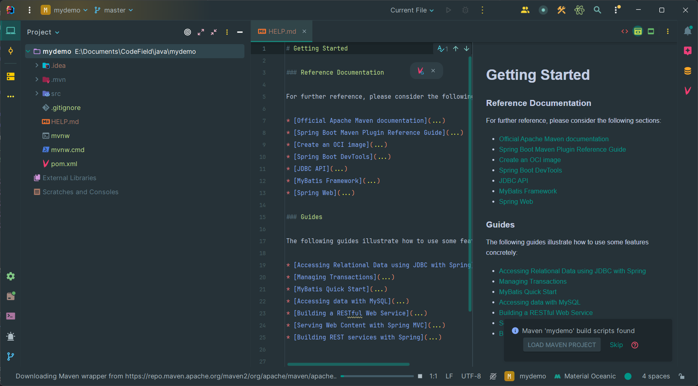
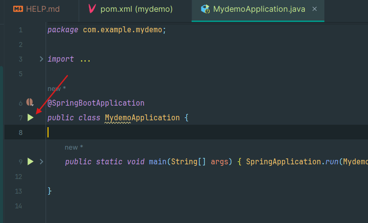

## 通过 IDEA 创建一个 SpringBoot 工程

### 新建工程
打开 IDEA ，选择 `New Project`

</img>

### 使用Spring Initializr 新建工程

</img>

### 添加必需的依赖
在左侧搜索栏中搜索并勾选以下依赖，然后点击`CREATE`

```
Spring Boot DevTools  // SpringBoot 开发工具
Spring Web           // Springboot Web应用开发工具
JDBC API      // 使用 JDBC 操作数据库
MySQL Driver // MySQL 数据库的驱动
MyBatis Framework  // Mybatis 框架
Lombok    // 使用注解快速生成 Getter/Setter ， 提高效率
```
</img>

## 生成工程
等待片刻后，我们得到了第一个 SpringBoot 工程

</img>

## 了解工程目录
</img>
```
│  pom.xml  // Maven 的配置文件
│
└─src
    ├─main
       ├─java
       │  └─com
       │      └─example
       │          └─demo2
       │                  Demo2Application.java  // 从这里启动应用
       │
       └─resources
```
用一个树状目录来展示一下我们需要留意的部分，我们打开 `Demo2Application.java` 文件，点击 `@SpringBootApplication`旁边的运行按钮，尝试运行应用，通常情况下会提示缺少依赖（网络问题导致依赖无法正常安装），此时我们需要为 Maven 配置国内的依赖下载源，详见*2.2通过 Maven 管理依赖*。
</br>**注意✨**：
- 如果你的工程名不是`demo2`而是`xxx`，对应的文件就是`xxxApplication.java`。
- `src\main\java\com\example\demo2` 中的 `\example\demo2` 这两层文件夹的名字根据个人创建工程时的命名而定。
- 在大多数 IDE 中，多层空目录会被显示为单个文件夹，例如`com\example\demo2`就会被显示为`com.example.demo2`。
</br>
</img>
</img>

