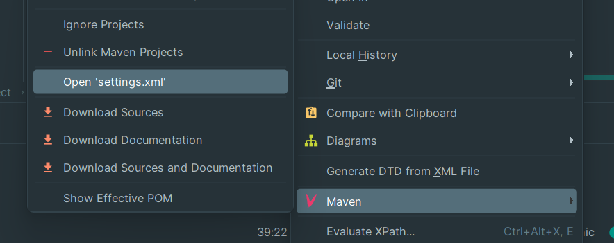

## 通过 Maven 管理依赖
### 依赖
所谓依赖，就是在 Java 工程中需要使用第三方的类、方法、库、框架等。通过 Maven 可以方便地管理这些依赖，但需要一点点额外的操作...
### 配置依赖的国内下载源
由于默认的下载源为国外站点，下载速度奇慢，时常会导致依赖无法正常安装，所以我们需要将 Maven 的依赖下载源修改为国内的阿里云镜像
#### 创建一个 settings.xml 并设置阿里云镜像
打开`pom.xml`，右键打开菜单，选择 `Maven` - `Create "settings.xml"`，用下面的内容替换掉文件里的内容。
</img> 
```xml
<?xml version="1.0" encoding="UTF-8"?>
<settings xmlns="http://maven.apache.org/SETTINGS/1.0.0"
          xmlns:xsi="http://www.w3.org/2001/XMLSchema-instance"
          xsi:schemaLocation="http://maven.apache.org/SETTINGS/1.0.0 http://maven.apache.org/xsd/settings-1.0.0.xsd">
<!--    阿里云镜像仓库-->
    <mirrors>
        <mirror>
            <id>aliyunmaven</id>
            <mirrorOf>central,public</mirrorOf>
            <name>阿里云公共仓库</name>
            <url>https://maven.aliyun.com/repository/public</url>
        </mirror>
    </mirrors>
</settings>
```

#### 让 Maven 加载依赖
打开`pom.xml`，右键打开菜单，选择 `Maven` - `Reload project`

</img>
</br> 

这时 IDEA 会提示我们正在下载依赖，静候大功告成~
