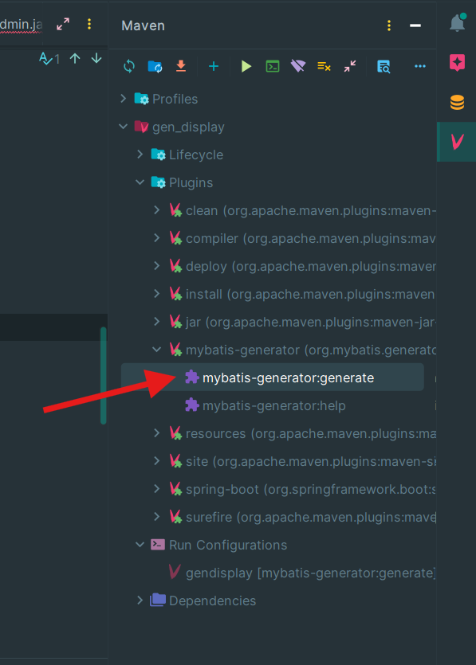
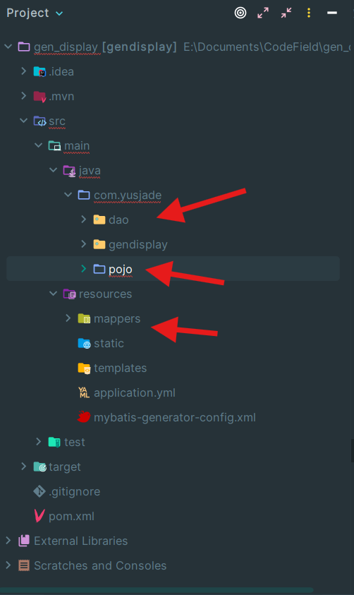

## 6.2 使用 mybatis-generator 生成代码
> [📖原文链接：GitHub](https://github.com/YusJade/SpringBoot-MyBatis-Example/blob/master/guide/chapter6_%E7%86%9F%E6%82%89%E5%A6%82%E4%BD%95%E4%BD%BF%E7%94%A8MyBatis/6.2%E4%BD%BF%E7%94%A8mybatis-generator%E7%94%9F%E6%88%90%E4%BB%A3%E7%A0%81.md)
> 
> [📖原文链接：Gitee（国内）](https://gitee.com/YouSaQVQ/SpringBoot-MyBatis-Example/blob/master/guide/chapter6_%E7%86%9F%E6%82%89%E5%A6%82%E4%BD%95%E4%BD%BF%E7%94%A8MyBatis/6.2%E4%BD%BF%E7%94%A8mybatis-generator%E7%94%9F%E6%88%90%E4%BB%A3%E7%A0%81.md)

`mybatis-generator` 插件可以为我们的工程生成 `Pojo(实体)`、`Dao` 和与之对应的 `Mapper`，提供操作数据库的基本方法。

### 在 pom.xml 配置依赖和插件
在你的`pom.xml`中按照标签位置添加相应的配置，并右键选择`Maven - Reload project`：
```xml
<project>
  <dependencies>
    <!-- 添加以下依赖配置 -->
    <dependency>
      <groupId>org.mybatis.generator</groupId>
      <artifactId>mybatis-generator-core</artifactId>
      <version>1.4.0</version>
    </dependency>
  </dependencies>
  <build>
    <plugins>
      <!-- 添加以下插件配置 -->
      <plugin>
        <groupId>org.mybatis.generator</groupId>
        <artifactId>mybatis-generator-maven-plugin</artifactId>
        <version>1.3.7</version>
        <configuration>
          <!--mybatis的代码生成器的配置文件-->
          <configurationFile>
            src/main/resources/mybatis-generator-config.xml
          </configurationFile>
          <!--允许覆盖生成的文件-->
          <!--有时候我们的数据库表添加了新字段，
              需要重新生成对应的文件。常规做法是手动删除旧文件，
              然后在用 MyBatis Generator 生成新文件。
              当然你也可以选择让 MyBatis Generator 覆盖旧文件，省下手动删除的步
              骤。-->
          <!--值得注意的是，MyBatis Generator
              只会覆盖旧的 po、dao、而 *mapper.xml 不会覆盖，而是追加，
              这样做的目的是防止用户自己写的 sql 语句一不小心都被 MyBatis Generator 给覆盖了-->
          <overwrite>true</overwrite>
          <verbose>true</verbose>
          <!--将当前pom的依赖项添加到生成器的类路径中-->
          <!--<includeCompileDependencies>true</includeCompileDependencies>-->
        </configuration>
        <dependencies>
          <!-- mysql的JDBC驱动 -->
          <dependency>
            <groupId>com.mysql</groupId>
            <artifactId>mysql-connector-j</artifactId>
            <version>8.3.0</version>
          </dependency>
          <dependency>
            <groupId>org.mybatis.generator</groupId>
            <artifactId>mybatis-generator-core</artifactId>
            <version>1.4.0</version>
          </dependency>
        </dependencies>
      </plugin>
    </plugins>
  </build>
</project>
```

### 在工程内新建配置文件
在`src/main/resources/`下新建`mybatis-generator-config.xml`，然后替换为以下内容：
```xml
<?xml version="1.0" encoding="UTF-8"?>
<!DOCTYPE generatorConfiguration
  PUBLIC "-//mybatis.org//DTD MyBatis Generator Configuration 1.0//EN"
  "http://mybatis.org/dtd/mybatis-generator-config_1_0.dtd">
<generatorConfiguration>
  <!-- targetRuntime： 设置生成的文件使用于哪个 MyBatis 版本  -->
  <context id="default" targetRuntime="MyBatis3">
    <!--optional,指在创建class时，对注释进行控制-->
    <commentGenerator>
      <property name="suppressDate" value="true"/>
      <!-- 是否去除自动生成的注释 true：是 ： false:否 -->
      <property name="suppressAllComments" value="true"/>
    </commentGenerator>
    <!--数据库链接地址账号密码-->
    <jdbcConnection driverClass="com.mysql.cj.jdbc.Driver"
      connectionURL="jdbc:mysql://127.0.0.1:3306/你的数据库名"
      userId="root"
      password="">
      <!--MySQL 8.x 需要指定服务器的时区-->
      <property name="serverTimezone" value="UTC"/>
      <!--MySQL 不支持 schema 或者 catalog 所以需要添加这个-->
      <!--参考 : http://www.mybatis.org/generator/usage/mysql.html-->
      <property name="nullCatalogMeansCurrent" value="true"/>
    </jdbcConnection>

    <!--生成pojo存放位置-->
    <!-- targetPackage： 生成实体类所在的包 -->
    <!-- targetProject： 生成实体类所在的硬盘位置 -->
    <javaModelGenerator targetPackage="你自己的包名.pojo" targetProject="src/main/java">

      <!-- 是否允许子包 -->
      <property name="enableSubPackages" value="true" />
      <!-- 是否对modal添加构造函数 -->
      <property name="constructorBased" value="true" />
      <!-- 是否清理从数据库中查询出的字符串左右两边的空白字符 -->
      <property name="trimStrings" value="true" />
      <!-- 建立modal对象是否不可改变 即生成的modal对象不会有setter方法，只有构造方法 -->
      <property name="immutable" value="false" />

    </javaModelGenerator>

    <!--生成映射文件存放位置-->
    <sqlMapGenerator targetPackage="mappers" targetProject="src/main/resources">
      <!-- 针对数据库的一个配置，是否把 schema 作为包名 -->
      <property name="enableSubPackages" value="true"/>
    </sqlMapGenerator>

    <!--生成Dao类存放位置  也就是生成接口所在的位置 -->
    <!-- 客户端代码，生成易于使用的针对Model对象和XML配置文件 的代码
            type="ANNOTATEDMAPPER",生成Java Model 和基于注解的Mapper对象
            type="MIXEDMAPPER",生成基于注解的Java Model 和相应的Mapper对象
            type="XMLMAPPER",生成SQLMap XML文件和独立的Mapper接口
    -->
    <javaClientGenerator type="XMLMAPPER" targetPackage="你自己的包名.dao" targetProject="src/main/java">
      <!-- 针对 Oracle 数据库的一个配置，是否把 schema 作为包名 -->
      <property name="enableSubPackages" value="true"/>
    </javaClientGenerator>

    <!--生成对应表及类名，这里每一个表的五项属性是为了删除自动编写的复杂查询-->
<!--     tableName: 对应的是数据库表名，domainObjectName： 是实体类的名字，可以自定义-->
    <table tableName="tb_admin" domainObjectName="Admin" enableCountByExample="false"
      enableUpdateByExample="false" enableDeleteByExample="false"
      enableSelectByExample="false" selectByExampleQueryId="false"/>
  </context>
</generatorConfiguration>

```
### 在 Maven plugin 中运行插件
在 IDEA 右侧的 Maven 选项卡中展开 `plugins/mybatis-generator`，双击`generate`运行插件，生成我们需要的代码。


生成 `Pojo(实体)`、`Dao` 和与之对应的 `Mapper`。


