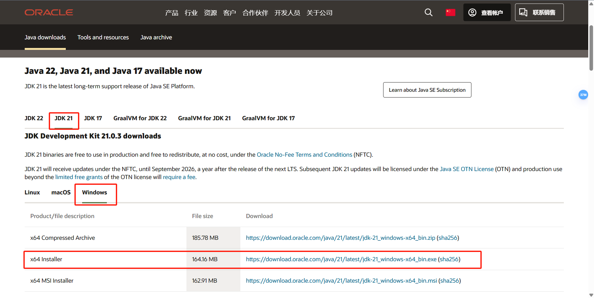
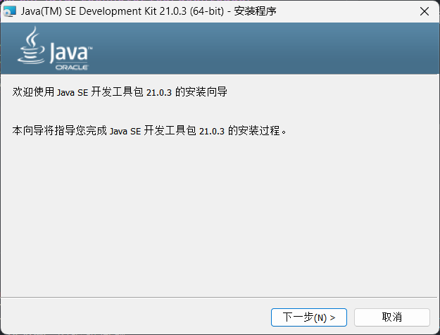

## 安装开发工具集 JDK
JDK 是 Java Development ToolKit 的简称，即 Java 开发工具集。JDK 是 Java 的核心，包括 Java 运行环境，Java 工具，以及 Java 基础类库。是开发 Java 应用程序必不可少的工具平台。

### 安装 JDK ：以 Oracle JDK21为例
Oracle JDK21 是 Oracle 公司目前提供长期更新支持的最新 JDK ，我们可以从官网获取对应版本的安装包： 
 [🌏 JDK Development Kit 21.0.3 downloads](https://www.oracle.com/cn/java/technologies/downloads/#jdk21-windows)

</img>
</img>
</img>

 在官网页面下载到 JDK 的 Installer 后打开，跟着安装程序的指引完成安装即可。