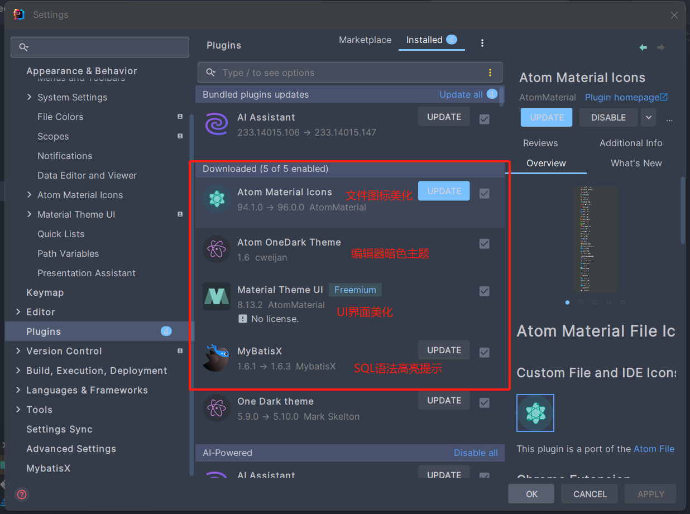

## 安装和配置开发环境：IntelliJ IDEA
> IDEA，全称IntelliJ IDEA，是 Java 语言的集成开发环境， IDEA 在业界被公认为是最好的 java 开发工具之一，一旦用上了就会上瘾。尤其在智能代码助手、代码自动提示、重构、 J2EE 支持、 Ant、 JUnit、 CVS 整合、代码审查、创新的 GUI 设计等方面的功能可以说是超常的。
> IntelliJ IDEA 主要用于支持 Java、 Scala、 Groovy 等语言的开发工具，同时具备支持目前主流的技术和框架，擅长于企业应用、移动应用和 Web 应用的开发
>
Intellij IDEA 是 JetBrains 开发的一套强大的 IDE ，本次我们选用它来完成课程设计工程的开发。
### 获取安装包

Intellij IDEA 提供了 社区版(Community) 和 付费旗舰版(Ultimate)。其中付费旗舰版提供了 SpringBoot Initializr ， 可以很方便地配置生成 SpringBoot 工程，因此我推荐使用旗舰版的30天使用版本，只需要注册 JetBrains 账号即可。 
[🌏 Welcome to JetBrains Account | 账号注册](https://account.jetbrains.com/login)
[🌏 IntelliJ IDEA DownLoad | 下载地址](https://www.jetbrains.com/idea/download/?section=windows)

### 安装步骤
打开从官网下载的安装程序，跟随指引选择安装路径，添加桌面快捷方式，等待安装完毕即可。
**参考文章**：[📖 知乎：Java小白必会！Intellij IDEA下载、安装、配置及使用详细教程](https://www.quanxiaoha.com/idea-pojie/idea-pojie-20241.html)
### 为你的 IDEA 安装插件（可选）
打开 IDEA ，在菜单左侧 `Plugins` 一栏，选中中间的 `Marketplace`，这里可以安装 IDEA 的插件，以辅助我们的开发。
⚠️注意：由于网络问题，可能无法成功安装插件，可更换网络环境后重试。以下是我推荐的几个插进。
</img>
#### 安装中文插件（可选）
在`Marketplace`中搜索`Chinese`，点击`Install`即可安装中文插件，这时 IDEA 的界面语言将会更改为中文。