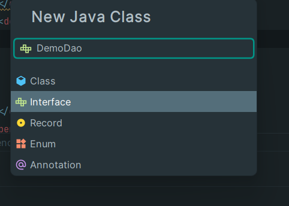

## 3.2编写第一个 Dao 层

### 在工程目录中新增相应目录和文件
如目录树所示，在`src/main/resources/`下新建一个`mappers`目录。
```
├─src
   ├─main
   │
   │
   └─resources
       ├─mappers // 新建这个目录
```
随后，我们在`src/main/resources/mappers`下新建文件`DemoDaoMapper.xml`，在`src/main/java/com/example/demo2/demos/web`下新建文件`DemoDao.java`

</img></br>
</img></br>

### 实现 Dao 层的功能
这里介绍到我们课程设计使用到的第二个技术—— MyBatis，它能够帮助我们实现 Dao 层的 SQL 操作，具体做法是新建一个 Java 的接口 `interface` (类似`C++`中的`纯虚类`)并在其中声明一些操作数据库的方法，但是我们不需要直接实现它，而是在一个`.xml`格式的文件中写明方法对应的 SQL 操作（这种方式叫做`Mapper`），这样 MyBatis 会为我们实现接口。这也是为什么我们需要新建上面的两个文件。
#### 编写 Dao 和 Mapper
现在我们得到了两个文件，我们将其中的内容分别替换为以下内容：
```xml
<?xml version="1.0" encoding="UTF-8" ?>
<!DOCTYPE mapper PUBLIC "-//mybatis.org//DTD Mapper 3.0//EN" "http://mybatis.org/dtd/mybatis-3-mapper.dtd" >
<mapper namespace="com.example.demo2.demos.web.DemoDao">
    <!--namespace根据自己需要创建的的mapper的路径和名称填写-->
    <select id="getAllUsers" resultType="com.example.demo2.demos.web.User">
        select * from user
    </select>
</mapper>

```
```java
package com.example.demo2.demos.web;

import org.apache.ibatis.annotations.Mapper;

import java.util.List;

@Mapper
public interface DemoDao {
    List<User> getAllUsers();
}

```
### 更新配置文件 `application.yml`
向其中追加以下内容：
```yml
mybatis:
  mapper-locations: classpath:mappers/*.xml
```

如此一来，在下一节3.3中，我们就可以开始测试我们的Dao层了。