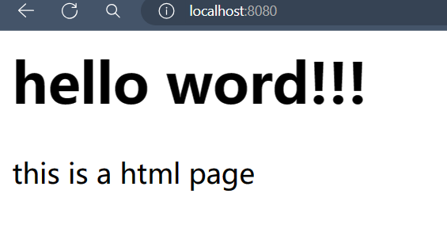

## 尝试运行第一个 SpringBoot 工程
### 尝试运行
前文我们学会了如何在工程运行我们应用，又解决了依赖安装的问题，现在我们再次运行应用，如果一切无恙，我们将会在下方的控制台窗口看到如下结果：
```log
21:06:49.792 [Thread-0] DEBUG org.springframework.boot.devtools.restart.classloader.RestartClassLoader - Created RestartClassLoader org.springframework.boot.devtools.restart.classloader.RestartClassLoader@7162bc85

  .   ____          _            __ _ _
 /\\ / ___'_ __ _ _(_)_ __  __ _ \ \ \ \
( ( )\___ | '_ | '_| | '_ \/ _` | \ \ \ \
 \\/  ___)| |_)| | | | | || (_| |  ) ) ) )
  '  |____| .__|_| |_|_| |_\__, | / / / /
 =========|_|==============|___/=/_/_/_/
 :: Spring Boot ::               (v2.6.13)

2024-05-15 21:06:50.035  INFO 75508 --- [  restartedMain] com.example.demo2.Demo2Application       : Starting Demo2Application using Java 21.0.1 on Yu-Gauss with PID 75508 (E:\Documents\CodeField\java\demo2\target\classes started by 19179 in E:\Documents\CodeField\java\demo2)
2024-05-15 21:06:50.035  INFO 75508 --- [  restartedMain] com.example.demo2.Demo2Application       : No active profile set, falling back to 1 default profile: "default"
2024-05-15 21:06:50.077  INFO 75508 --- [  restartedMain] .e.DevToolsPropertyDefaultsPostProcessor : Devtools property defaults active! Set 'spring.devtools.add-properties' to 'false' to disable
2024-05-15 21:06:50.077  INFO 75508 --- [  restartedMain] .e.DevToolsPropertyDefaultsPostProcessor : For additional web related logging consider setting the 'logging.level.web' property to 'DEBUG'
2024-05-15 21:06:50.499  WARN 75508 --- [  restartedMain] o.m.s.mapper.ClassPathMapperScanner      : No MyBatis mapper was found in '[com.example.demo2]' package. Please check your configuration.
2024-05-15 21:06:50.832  INFO 75508 --- [  restartedMain] o.s.b.w.embedded.tomcat.TomcatWebServer  : Tomcat initialized with port(s): 8080 (http)
2024-05-15 21:06:50.840  INFO 75508 --- [  restartedMain] o.apache.catalina.core.StandardService   : Starting service [Tomcat]
2024-05-15 21:06:50.840  INFO 75508 --- [  restartedMain] org.apache.catalina.core.StandardEngine  : Starting Servlet engine: [Apache Tomcat/9.0.68]
2024-05-15 21:06:50.920  INFO 75508 --- [  restartedMain] o.a.c.c.C.[Tomcat].[localhost].[/]       : Initializing Spring embedded WebApplicationContext
2024-05-15 21:06:50.920  INFO 75508 --- [  restartedMain] w.s.c.ServletWebServerApplicationContext : Root WebApplicationContext: initialization completed in 842 ms
2024-05-15 21:06:51.091  INFO 75508 --- [  restartedMain] o.s.b.a.w.s.WelcomePageHandlerMapping    : Adding welcome page: class path resource [static/index.html]
2024-05-15 21:06:51.127  WARN 75508 --- [  restartedMain] ConfigServletWebServerApplicationContext : Exception encountered during context initialization - cancelling refresh attempt: org.springframework.beans.factory.BeanCreationException: Error creating bean with name 'dataSource' defined in class path resource [org/springframework/boot/autoconfigure/jdbc/DataSourceConfiguration$Hikari.class]: Bean instantiation via factory method failed; nested exception is org.springframework.beans.BeanInstantiationException: Failed to instantiate [com.zaxxer.hikari.HikariDataSource]: Factory method 'dataSource' threw exception; nested exception is org.springframework.boot.autoconfigure.jdbc.DataSourceProperties$DataSourceBeanCreationException: Failed to determine a suitable driver class
2024-05-15 21:06:51.128  INFO 75508 --- [  restartedMain] o.apache.catalina.core.StandardService   : Stopping service [Tomcat]
2024-05-15 21:06:51.140  INFO 75508 --- [  restartedMain] ConditionEvaluationReportLoggingListener : 

Error starting ApplicationContext. To display the conditions report re-run your application with 'debug' enabled.
2024-05-15 21:06:51.152 ERROR 75508 --- [  restartedMain] o.s.b.d.LoggingFailureAnalysisReporter   : 

***************************
APPLICATION FAILED TO START
***************************

Description:

Failed to configure a DataSource: 'url' attribute is not specified and no embedded datasource could be configured.

Reason: Failed to determine a suitable driver class


Action:

Consider the following:
	If you want an embedded database (H2, HSQL or Derby), please put it on the classpath.
	If you have database settings to be loaded from a particular profile you may need to activate it (no profiles are currently active).


Process finished with exit code 0
```
### 看懂应用启动日志
上面这段日志提供了一段重要信息：启动成功但是出现了错误，程序正常退出。现在我们来细细端详这些片段：
```log
Failed to determine a suitable driver class
无法选定合适的驱动类

Error starting ApplicationContext. To display the conditions report re-run your application with 'debug' enabled.
启动 ApplicationContext 时出错。要显示条件报告，请使用“debug”模式重新运行您的应用程序

2024-05-15 21:06:51.152 ERROR 75508 --- [  restartedMain] o.s.b.d.LoggingFailureAnalysisReporter   : 

***************************
APPLICATION FAILED TO START
应用程序启动失败
***************************

Description:

Failed to configure a DataSource: 'url' attribute is not specified and no embedded datasource could be configured.

Reason: Failed to determine a suitable driver class

描述：
无法配置数据源：未指定“url”属性，且无法配置嵌入数据源。
原因：未能确定合适的驱动类

Action:

Consider the following:
	If you want an embedded database (H2, HSQL or Derby), please put it on the classpath.
	If you have database settings to be loaded from a particular profile you may need to activate it (no profiles are currently active).

操作建议：
请考虑以下几点：
如果您想要使用嵌入式数据库（H2、HSQL或Derby），请将其放入类路径。
如果您有要从特定配置文件加载的数据库设置，您可能需要激活该配置文件（当前未激活任何配置文件）。
```
善用运行日志和翻译工具，我们不难看出错误与数据库的配置有关，下面我们就来解决这个问题。
### 配置数据库连接
我们的 SpringBoot 应用需要连接到数据库，来看看如何配置吧！
#### 修改工程配置文件的格式
根据目录树，找到`application.properties`的后缀修改为`.yml`，这会方便我们之后的配置，具体步骤为：鼠标右键文件 - `Refactor(重构)` - `Rename...(重命名)`
```
├─src
│  ├─main
│  │  ├─java
│  │  │  └─com
│  │  │      └─example
│  │  │          └─demo2
│  │  │              │  Demo2Application.java
│  │  │              │
│  │  │              └─demos
│  │  │                  └─web
│  │  │                          BasicController.java
│  │  │                          PathVariableController.java
│  │  │                          User.java
│  │  │
│  │  └─resources
│  │      │  application.yml
```
随后我们打开重命名后的配置文件，将其中内容替换为：
```yml
# 注意必须严格缩进

# 表示该层次内是与 spring 相关的配置
spring: 
  # 配置数据库相关
  datasource:
    # 连接数据库的地址
    # jdbc:mysql://127.0.0.1:3306/test 
    # 表示使用 jdbc 连接 mysql 服务中名为 test 的数据库 
    # useUnicode=true&characterEncoding=UTF-8 设置字符集编码方式
    # allowMultiQueries=true 使得 jdbc 可以批量执行sql语句
    url: jdbc:mysql://127.0.0.1:3306/test?useUnicode=true&characterEncoding=UTF-8&allowMultiQueries=true
    # 记得设置你的用户名
    username: root 
    # 记得设置你的密码 >_<
    password: root
    # 使用的数据库驱动包
    driver-class-name: com.mysql.cj.jdbc.Driver
```

### 完成配置后再次启动应用
再来一次，启动应用！
```log
21:50:32.991 [Thread-0] DEBUG org.springframework.boot.devtools.restart.classloader.RestartClassLoader - Created RestartClassLoader org.springframework.boot.devtools.restart.classloader.RestartClassLoader@7162bc85

  .   ____          _            __ _ _
 /\\ / ___'_ __ _ _(_)_ __  __ _ \ \ \ \
( ( )\___ | '_ | '_| | '_ \/ _` | \ \ \ \
 \\/  ___)| |_)| | | | | || (_| |  ) ) ) )
  '  |____| .__|_| |_|_| |_\__, | / / / /
 =========|_|==============|___/=/_/_/_/
 :: Spring Boot ::               (v2.6.13)

2024-05-15 21:50:33.244  INFO 84928 --- [  restartedMain] com.example.demo2.Demo2Application       : Starting Demo2Application using Java 21.0.1 on Yu-Gauss with PID 84928 (E:\Documents\CodeField\java\demo2\target\classes started by 19179 in E:\Documents\CodeField\java\demo2)
2024-05-15 21:50:33.245  INFO 84928 --- [  restartedMain] com.example.demo2.Demo2Application       : No active profile set, falling back to 1 default profile: "default"
2024-05-15 21:50:33.279  INFO 84928 --- [  restartedMain] .e.DevToolsPropertyDefaultsPostProcessor : Devtools property defaults active! Set 'spring.devtools.add-properties' to 'false' to disable
2024-05-15 21:50:33.280  INFO 84928 --- [  restartedMain] .e.DevToolsPropertyDefaultsPostProcessor : For additional web related logging consider setting the 'logging.level.web' property to 'DEBUG'
2024-05-15 21:50:33.640  WARN 84928 --- [  restartedMain] o.m.s.mapper.ClassPathMapperScanner      : No MyBatis mapper was found in '[com.example.demo2]' package. Please check your configuration.
2024-05-15 21:50:33.938  INFO 84928 --- [  restartedMain] o.s.b.w.embedded.tomcat.TomcatWebServer  : Tomcat initialized with port(s): 8080 (http)
2024-05-15 21:50:33.948  INFO 84928 --- [  restartedMain] o.apache.catalina.core.StandardService   : Starting service [Tomcat]
2024-05-15 21:50:33.949  INFO 84928 --- [  restartedMain] org.apache.catalina.core.StandardEngine  : Starting Servlet engine: [Apache Tomcat/9.0.68]
2024-05-15 21:50:34.008  INFO 84928 --- [  restartedMain] o.a.c.c.C.[Tomcat].[localhost].[/]       : Initializing Spring embedded WebApplicationContext
2024-05-15 21:50:34.009  INFO 84928 --- [  restartedMain] w.s.c.ServletWebServerApplicationContext : Root WebApplicationContext: initialization completed in 729 ms
2024-05-15 21:50:34.166  INFO 84928 --- [  restartedMain] o.s.b.a.w.s.WelcomePageHandlerMapping    : Adding welcome page: class path resource [static/index.html]
2024-05-15 21:50:34.314  INFO 84928 --- [  restartedMain] o.s.b.d.a.OptionalLiveReloadServer       : LiveReload server is running on port 35729
2024-05-15 21:50:34.344  INFO 84928 --- [  restartedMain] o.s.b.w.embedded.tomcat.TomcatWebServer  : Tomcat started on port(s): 8080 (http) with context path ''
2024-05-15 21:50:34.351  INFO 84928 --- [  restartedMain] com.example.demo2.Demo2Application       : Started Demo2Application in 1.352 seconds (JVM running for 1.837)
2024-05-15 21:51:04.023  INFO 84928 --- [nio-8080-exec-1] o.a.c.c.C.[Tomcat].[localhost].[/]       : Initializing Spring DispatcherServlet 'dispatcherServlet'
2024-05-15 21:51:04.024  INFO 84928 --- [nio-8080-exec-1] o.s.web.servlet.DispatcherServlet        : Initializing Servlet 'dispatcherServlet'
2024-05-15 21:51:04.025  INFO 84928 --- [nio-8080-exec-1] o.s.web.servlet.DispatcherServlet        : Completed initialization in 1 ms
```
没有碍眼的红色报错，程序也没有退出，说明我们的应用正在运行！特别注意这一条：
```log
2024-05-15 21:50:34.344  INFO 84928 --- [  restartedMain] o.s.b.w.embedded.tomcat.TomcatWebServer  : Tomcat started on port(s): 8080 (http) with context path ''
```
这说明我们的 web 服务在 `localhost:8080`上启动了，现在去浏览器上瞧瞧吧！

</img>

恭喜你！在学习 SpringBoot 的路上又迈出了关键的一步~
</img>