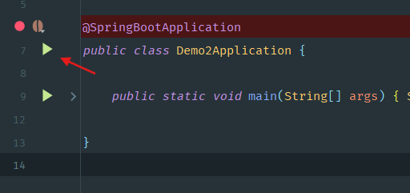
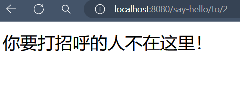

## 5.2 从 Application 启动应用

### 启动应用
至此，我们完成了`Dao`、`Service`、`Controller`，现在我们可以通过`Application`启动应用，然后在浏览器上测试我们的功能了~

### 在浏览器上测试功能
在地址栏输入对应的`url`：
 - `localhost:8080/say-hello`
 - `localhost:8080/say-hello/to/0`
 - `localhost:8080/say-hello/to/1`
 - `localhost:8080/say-hello/to/2` 

然后观察浏览器呈现的内容：
<table>

</table>

大功告成！