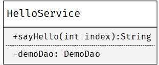
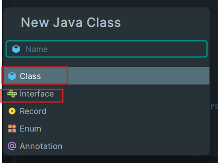

## 4.1 编写一个 HelloService

我们来设计一个这样的`HelloService`，其中有一个方法`sayHello`，传入一个整型`index`，它返回一个字符串`"{第index个用户的name}，你好呀！"`作为问候。



### 编写 Service

我们在`src/main/java/com/example/demo2`下右键新建以下文件：
- `class`名为`HelloService`



代码如下：

```java
@Service
public class HelloService {

    @Resource
    DemoDao demoDao;

    @Override
    public String sayHello(Integer index) {
        List<User> list = demoDao.getAllUsers();
        if (index >= list.size() || index < 0) {
            return "你要打招呼的人不在这里！";
        }
        return String.format("你好，%s！:>", list.get(index).getName());
    }
}
```

### 测试 Service
这里还是使用到我们的`ApplicationTests`，将测试代码写好，运行测试即可。

```java

@SpringBootTest
class Demo2ApplicationTests {

    @Resource
    HelloService helloService;

    @Test
    void contextLoads() {
        System.out.println(helloService.sayHello(0));
        System.out.println(helloService.sayHello(1));
        System.out.println(helloService.sayHello(2));
    }
}
```
</br>

测试结果如下，这样我们的 `HelloService`就写好了。
```
前面省略......
2024-05-17 20:36:59.082  INFO 94576 --- [           main] com.zaxxer.hikari.HikariDataSource       : HikariPool-1 - Starting...
2024-05-17 20:36:59.519  INFO 94576 --- [           main] com.zaxxer.hikari.HikariDataSource       : HikariPool-1 - Start completed.
你好，FireFly！:>
你好，SAM！:>
你要打招呼的人不在这里！
2024-05-17 20:36:59.579  INFO 94576 --- [ionShutdownHook] com.zaxxer.hikari.HikariDataSource       : HikariPool-1 - Shutdown initiated...
2024-05-17 20:36:59.582  INFO 94576 --- [ionShutdownHook] com.zaxxer.hikari.HikariDataSource       : HikariPool-1 - Shutdown completed.

Process finished with exit code 0
```